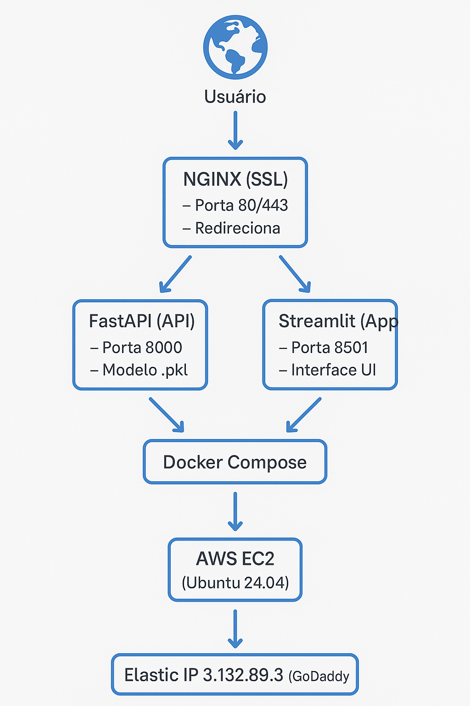

# ❤️ Diagnóstico de Doença Cardíaca com Machine Learning

Este projeto implementa um pipeline completo de *Machine Learning* — da análise exploratória ao deploy em produção — para construir uma solução preditiva capaz de identificar a presença de doença cardíaca com base em variáveis clínicas.

---

## 🎯 Objetivo

Desenvolver um modelo supervisionado que receba dados clínicos e retorne a probabilidade de presença de doença cardíaca.
A solução está disponível via **API (FastAPI)** e **interface interativa (Streamlit)**, ambas hospedadas em um ambiente **containerizado (Docker)** e servidas por **Nginx com HTTPS** na **AWS EC2**.

---

## 🚑 Recuperação e Estabilização do Ambiente (Disaster Recovery)

Após duas falhas críticas no ambiente de produção — a primeira envolvendo corrupção do daemon Docker e conflito entre *snap* e *apt*, e a segunda relacionada ao isolamento de rede entre containers e Nginx — foi conduzido um **processo completo de Disaster Recovery em duas fases**, resultando na restauração integral da infraestrutura.

### 🩺 **Fase 1 — Recuperação do Docker Engine e Containers**

* Diagnóstico e correção de *socket corruption* e processos zumbis;
* Reconfiguração e rebuild completo via `docker-compose.prod.yml`;
* Correção do `proxy_pass` no Nginx (mapeamento interno para containers);
* Inserção de rota de *health check* na API (`/` → status operacional);
* Verificação e restauração do SSL (*Let’s Encrypt*);
* Testes de conectividade via `curl` e validação HTTPS via navegador.

### 🛠 **Fase 2 — Reconstrução de Rede, Proxy e DNS Interno**

* Eliminação de conflito entre `docker-compose.yml` e `docker-compose.prod.yml`;
* Padronização do Compose e configuração de variáveis globais (`COMPOSE_FILE` e `COMPOSE_PROJECT_NAME`);
* Desativação do Nginx do host e migração para container próprio (`heart-nginx`);
* Criação de diretório persistente `./nginx` com configuração isolada (`heart-disease.conf`);
* Inclusão explícita do Nginx na rede `heart-disease-diagnosis_appnet`;
* Rebuild limpo com remoção de *orphans* e *networks* antigas;
* Testes de conectividade interna (`ping`, `curl`) confirmando comunicação entre `heart-api`, `heart-app` e `heart-nginx`;
* Validação externa HTTPS com certificados válidos e proxy reverso funcional.

🟢 **Resultado final:**
Ambiente **100% operacional, estável e seguro**, com comunicação interna entre containers, roteamento reverso via Nginx funcional e certificados SSL ativos.

---

## 📦 Dataset

* **Fonte:** [Heart Disease Dataset - Kaggle](https://www.kaggle.com/datasets/johnsmith88/heart-disease-dataset)
* **Variáveis:** idade, sexo, pressão arterial, colesterol, eletrocardiograma, frequência cardíaca, entre outras
* **Target:** presença (`1`) ou ausência (`0`) de doença cardíaca

---

## 🧪 Ciclo de Vida Aplicado

1. **Análise Exploratória** (`notebooks/01_eda.ipynb`)
2. **Modelagem e Avaliação** (`notebooks/02_modelagem.ipynb`)
3. **Treinamento e Exportação do Modelo** (`model/random_forest.pkl`)
4. **Deploy da API** com **FastAPI** (`api/main.py`)
5. **Interface Interativa** com **Streamlit** (`app/dashboard.py`)
6. **Containerização e Orquestração** com **Docker + Docker Compose**
7. **Serviço Web** com **Nginx** e **HTTPS automático (Let’s Encrypt)**
8. **Infraestrutura** em **AWS EC2 (Ubuntu 24.04 + Elastic IP)**
9. **Disaster Recovery** completo — duas fases concluídas com sucesso ✅

---

## 🧠 Modelos Avaliados

* Regressão Logística
* Árvore de Decisão
* Random Forest ✅
* SVM
* KNN
* MLP

> O modelo **Random Forest** foi selecionado para deploy por apresentar o melhor equilíbrio entre acurácia, robustez e interpretabilidade.

---

## 🚀 Tecnologias Utilizadas

| Categoria           | Ferramentas                                      |
| ------------------- | ------------------------------------------------ |
| Linguagem           | Python 3.11                                      |
| Análise e Modelagem | Pandas, NumPy, Scikit-Learn, Matplotlib, Seaborn |
| API                 | FastAPI + Uvicorn                                |
| Frontend            | Streamlit                                        |
| Infraestrutura      | Docker, Docker Compose                           |
| Servidor Web        | Nginx (proxy reverso)                            |
| Certificados        | Let’s Encrypt (Certbot)                          |
| Cloud               | AWS EC2 (Ubuntu, Elastic IP)                     |
| Controle de Versão  | Git + GitHub                                     |
| Observabilidade     | Health check `/` + logs Nginx e containers       |

---

## 📁 Estrutura do Projeto

```
heart-disease-diagnosis/
│
├── api/
│   ├── main.py               # API FastAPI
│   ├── requirements.txt
│   └── Dockerfile
│
├── app/
│   ├── dashboard.py          # Interface Streamlit
│   ├── requirements.txt
│   └── Dockerfile
│
├── nginx/
│   └── heart-disease.conf    # Configuração unificada de proxy reverso
│
├── model/
│   └── random_forest.pkl     # Modelo treinado
│
├── notebooks/
│   ├── 01_eda.ipynb
│   └── 02_modelagem.ipynb
│
├── docker-compose.prod.yml   # Orquestração dos serviços
├── reset-heart.sh            # Script de rebuild e reset completo
├── README.md
└── LICENSE
```

---

## 🧪 Como Executar Localmente

```bash
# Clone o repositório
git clone https://github.com/seu-usuario/heart-disease-diagnosis.git
cd heart-disease-diagnosis

# Crie ambiente virtual
python -m venv venv
source venv/bin/activate  # ou venv\Scripts\activate no Windows

# Instale dependências
pip install -r api/requirements.txt
pip install -r app/requirements.txt

# Execute a API localmente
uvicorn api.main:app --host 0.0.0.0 --port 8000

# Execute a interface
streamlit run app/dashboard.py
```

---

## 🐳 Execução com Docker

```bash
# Build e inicialização dos containers
docker compose -f docker-compose.prod.yml up -d --build

# Verificar serviços ativos
docker ps

# API acessível em:
# http://localhost:8000/docs

# Dashboard acessível em:
# http://localhost:8501
```

---

## ☁️ Deploy em Produção (AWS EC2)

A aplicação completa roda em:

* **Ubuntu 24.04 (EC2 Instance)**
* **Nginx** como proxy reverso
* **HTTPS (Let’s Encrypt)**
* **Elastic IP fixo:** `3.132.89.3`
* **Domínios configurados via GoDaddy:**

  * [https://api.heartdiseaseapp.com](https://api.heartdiseaseapp.com)
  * [https://app.heartdiseaseapp.com](https://app.heartdiseaseapp.com)

---

## 🧱 Infraestrutura de Produção

A aplicação está hospedada em um ambiente **containerizado e seguro na AWS EC2**, utilizando **Nginx como proxy reverso** e **certificados HTTPS automáticos (Let’s Encrypt)**.
O fluxo de requisições segue a arquitetura abaixo:



---

## 📈 Status do Projeto

| Etapa                | Status        |
| -------------------- | ------------- |
| EDA                  | ✅ Concluída   |
| Modelagem            | ✅ Concluída   |
| Avaliação            | ✅ Concluída   |
| Deploy API           | ✅ Online      |
| Interface Streamlit  | ✅ Online      |
| Docker e AWS         | ✅ Em produção |
| Nginx + SSL          | ✅ Ativo       |
| Disaster Recovery F1 | ✅ Concluído   |
| Disaster Recovery F2 | ✅ Concluído   |

---

## 📄 Licença

Este projeto está licenciado sob a **MIT License**.
Sinta-se à vontade para utilizar, modificar e redistribuir com os devidos créditos.

---

### 👨‍💻 Autor

**Ariel Soares**
Desenvolvedor e pesquisador em *Machine Learning*, com foco em aplicações práticas de IA, engenharia de sistemas e automação em nuvem.
📧 [LinkedIn](https://linkedin.com/in/ari-soares)

---
